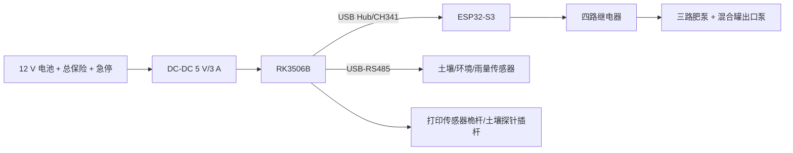

# 智润四轮独立悬挂底盘打印方案

这是面向当前智润硬件的移动式承载底盘方案：RK3506B 触控主机、ESP32-S3、USB-RS485、12 V 电池、线束和传感器都安装在底盘上层；泵和肥液管路仍建议安装在独立的防水拖车或固定机架上，不让液体重量直接压在打印件上。

## 设计基准

| 项目 | 设计值 |
| --- | ---: |
| 打印面 | 280 × 280 mm |
| 成品底盘外廓 | 250 × 210 mm |
| 结构底板 | 左右两块，各 125 × 210 × 6 mm |
| 轴距建议 | 185 mm |
| 轮距建议 | 205 mm |
| 轮胎 | 4 个 100--110 mm 橡胶轮，8 mm 轮轴 |
| 额定载荷（建议） | 20 kg 以内，低速平整地面 |
| 悬挂行程 | 25--35 mm，取决于所购 RC 油压避震长度 |
| 电子托盘有效区 | 180 × 130 mm，使用长孔适配不同板卡 |

`chassis.scad` 是参数化源文件。将 `part` 改为 `base_left`、`swing_arm` 等即可单独导出 STL；把 `part` 设为 `plate`、再把 `plate` 设为 1/2/3，即可分别导出三盘打印布局。`layout` 只用于预览三盘的相对摆放，不建议把 layout 整体当成一盘直接打印。

命令行导出示例（使用 OpenSCAD）：

```text
openscad -o plate-1-base.stl -D 'part="plate"' -D 'plate=1' chassis.scad
openscad -o plate-2-suspension.stl -D 'part="plate"' -D 'plate=2' chassis.scad
openscad -o plate-3-tray-mast.stl -D 'part="plate"' -D 'plate=3' chassis.scad
```

如果要做多台底盘，重复打印 2 号盘和 3 号盘即可；每增加一台，盘 1、盘 2、盘 3 各增加一套，轮胎、避震器和电机也按整套增加。

## 分盘打印

| 盘号 | 零件 | 数量 | 单件最大尺寸 | 建议材料 |
| --- | --- | ---: | ---: | --- |
| 1 | `base_left`、`base_right` | 各 1 | 125 × 210 × 14 mm | PETG 或 ASA |
| 2 | `swing_arm` | 4 | 120 × 36 × 18 mm | PETG-CF/尼龙 |
| 2 | `tower` | 4 | 42 × 34 × 52 mm | PETG-CF/尼龙 |
| 3 | `electronics_tray` | 1 | 180 × 130 × 26 mm | PETG 或 ASA |
| 3 | `mast` | 1 | 100 × 42 × 174 mm | ASA/PETG |
| 3 | `wheel_hub` | 4 | 78 × 78 × 18 mm | PETG |
| 3 | `cable_clip` | 8--16 | 24 × 16 × 8 mm | PETG/TPU |

建议在切片器中把悬挂摆臂和塔架按受力方向摆放，4--6 道壁、40--60% gyroid 填充；底板 5 道壁、30--40% 填充；电子托盘 4 道壁、25--35% 填充。户外日晒使用 ASA，室内或短期测试使用 PETG。PLA 不建议作为长期户外承力件。

打印前先在切片器中检查底板中心连接法兰和所有孔位。M4/M8 孔保留 0.2--0.4 mm 装配间隙，第一次打印建议只打印一个塔架和一个摆臂做试装。

## 装配顺序

1. 将左右底板用 3 组 M5 穿透螺栓和锁紧螺母连接，接缝下方加一条 20×3 mm 铝扁条或 2020 铝型材作金属加强件。
2. 每个角位安装一个打印塔架；塔架与底板之间使用 M4×20 螺栓、垫片和尼龙锁紧螺母。
3. 摆臂用 8 mm 光轴/肩螺栓穿过塔架，轴两端使用法兰轴承或铜套；摆臂的第二孔连接 100--120 mm RC 油压避震。
4. 轮毂使用 8 mm 轴和轮毂螺栓固定在摆臂外侧。打印轮毂只作为适配盘，真正承载由金属轮轴、轴承和橡胶轮承担。
5. 电子托盘放在底板中部，RK3506B、ESP32-S3 和 USB-RS485 之间保持至少 20 mm 线束弯曲空间；ESP32 继电器输出线与 RS485 线分槽走线。
6. 传感器桅杆安装在底盘后侧或侧面，土壤探针不要固定在桅杆上，应使用独立插杆，避免车辆振动改变插入深度。
7. 电池放在底盘最低处，用两条 20 mm 宽尼龙绑带和金属压条双重固定；所有强电回路加保险和物理急停。

## 与现有智润硬件的接口



打印底盘不替代电气防护：泵的电源回路必须使用额定匹配的接触器、空开/保险、漏保和实体急停；ESP32 GPIO 只能连接继电器模块低压输入，不能直接带泵。

## 首次试车验收

- 空载推行，确认四个摆臂无卡滞，轮轴不偏磨。
- 逐个压缩避震，确认摆臂不会撞击底板和线束。
- 加 5 kg、10 kg、15 kg 负载各运行 10 分钟，检查接缝、塔架和螺栓松动。
- 先断开泵的强电，只验证 ESP32 四路继电器逻辑；再接入低压测试负载，最后才接泵。
- 车辆移动时关闭泵和混合罐出口泵，传感器线束留出悬挂行程，避免被轮胎卷入。

该方案是工程样机结构，不是经过强度、碰撞、防水或载人认证的车辆底盘；超过 20 kg、坡地高速或长期户外使用前应把底板和塔架改为金属件或进行实测结构验证。
