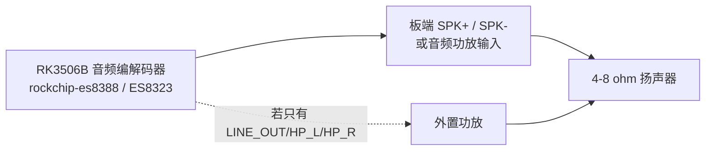

# RK3506B 扬声器接线与开机动画

## 开机流程

`assets/zhirun_boot_animation.mp4` 是 `demo/ikun.mp4` 的前 6 秒原始裁剪；为适配板端
现有能力，同一画面另转为 LVGL 可直接显示的 RGB565 帧序列，并将声音转为板端原生
16kHz 单声道 PCM WAV。部署后的运行文件位于：

```text
/userdata/zhirun/zhirun_boot_frames.rgb565
/userdata/zhirun/zhirun_boot_audio.wav
```

`/etc/init.d/S99zhirun-hmi` 启动时会先停止旧界面并初始化音频控件。HMI 将第一帧提交到 LCD
之后才启动 WAV，并从同一时刻开始 RGB565 帧序列计时；6 秒后创建正常监控界面。这样不会依赖
GStreamer 的完整插件集合，也不会和现有 DRM 显示层抢占资源。

## 接线拓扑



| 板端标识 | 连接 | 说明 |
| --- | --- | --- |
| `SPK+` / `SPK-` | 无源 4-8 ohm 扬声器正负端 | 仅在载板已经带扬声器功放时使用，极性不要反接 |
| `LINE_OUT`、`HP_L/R` | 外置功放输入 | 这些是小信号输出，不能直接带无源扬声器 |
| `GND` | 外置功放信号地 | 只接功放的信号地，按载板原理图确认 |

实际端子名称以载板丝印和原理图为准；不要把扬声器接到 GPIO、继电器 `IN`、5V 电源或 USB 数据线上。
接线和插拔前关闭板卡电源。板端启动脚本会尝试打开 ALSA 的 `Speaker`、`PCM`、`Output 1`、`Output 2`
控件，控件不存在时不会阻止系统启动。

## 声音自检

在板端执行以下命令确认声卡和扬声器路径：

```sh
aplay -l
amixer -c 0 scontrols
speaker-test -D plughw:0,0 -c 1 -t sine -f 1000 -l 1
```

停止自检使用 `Ctrl+C`。当前板端已识别 `rockchipes8388` 播放设备；若载板更换，先以 `aplay -l`
显示的卡号替换命令中的 `0`。
